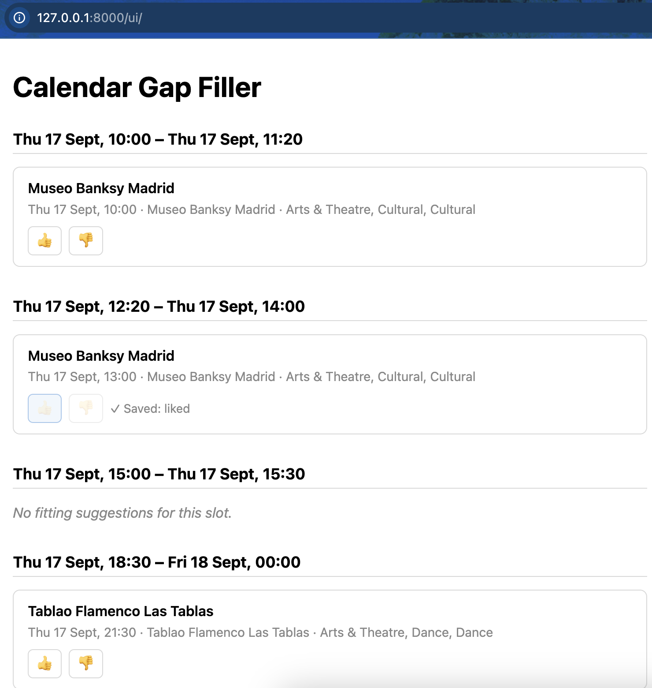
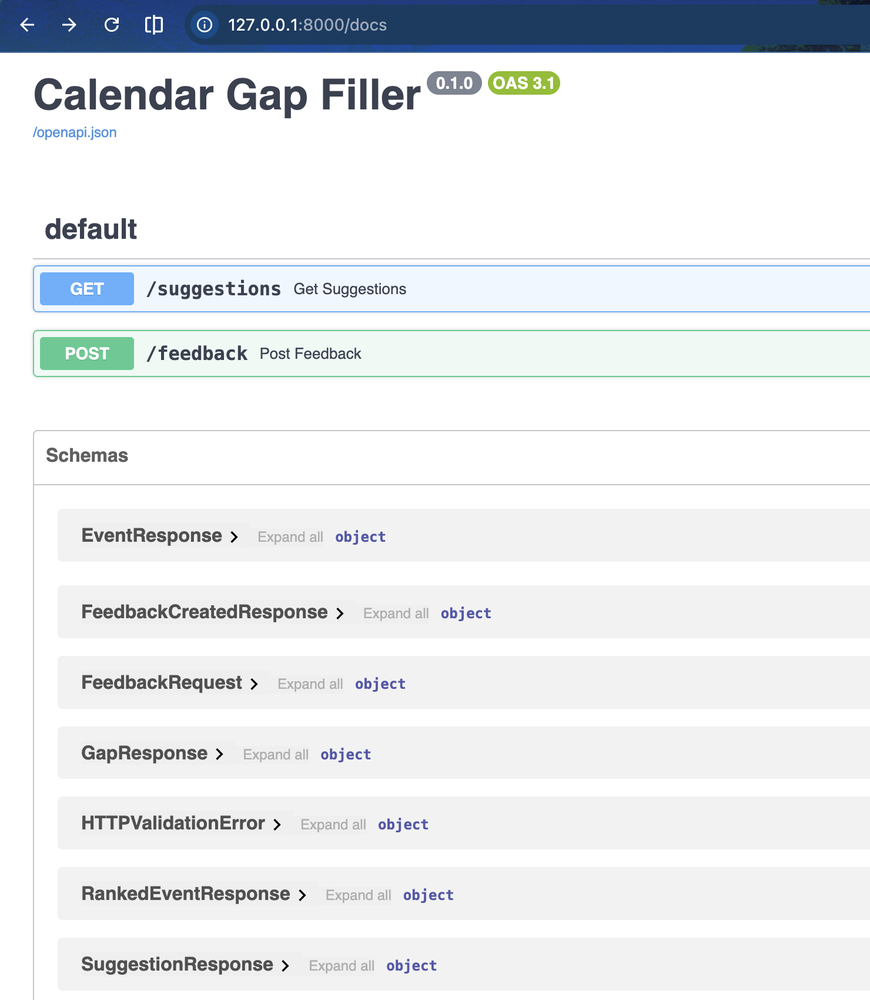

# Calendar Gap Filler

An AI-powered scheduling assistant that finds empty slots in your calendar and
fills them with personalized, locally relevant events based on your interests
and real-time availability.

## Screenshots

**Suggestions UI** — this week's gaps filled with locally relevant events; feedback
(👍/👎) is saved per suggestion:



**API docs** — auto-generated OpenAPI/Swagger UI at `/docs`:



## Setup

### 1. Install dependencies

```bash
python3 -m venv venv
source venv/bin/activate
pip install -r requirements.txt
```

### 2. Google Calendar API credentials

The app reads your Google Calendar (read-only) via the official Google Calendar API.

1. Go to the [Google Cloud Console](https://console.cloud.google.com/) and create a new project.
2. Enable the **Google Calendar API** for that project (APIs & Services → Library).
3. Configure the **OAuth consent screen**:
   - User type: External
   - Publishing status: Testing (no Google verification needed for personal use)
   - Add your own Google account under **Test users**
4. Create credentials: APIs & Services → Credentials → Create Credentials → OAuth client ID.
   - Application type: **Desktop app**
5. Download the resulting JSON file, rename it to `credentials.json`, and place it in the
   project root. This file is gitignored — never commit it.
6. On first run, the app will open a browser window asking you to log in and grant
   read-only calendar access. After that, a `token.json` file is created and cached
   locally so you won't need to log in again (also gitignored).
7. Because the consent screen is in "Testing" status, Google expires `token.json`
   roughly every 7 days regardless of use. If you see an error about the refresh
   token being expired or revoked, just delete `token.json` and run again — the
   browser login flow will repeat and issue a fresh one.

### 3. Ticketmaster API key

Local events are sourced from the [Ticketmaster Discovery API](https://developer.ticketmaster.com/products-and-docs/apis/discovery-api/v2/)
(free tier: 5000 calls/day, 5 requests/second).

1. Register for a developer account at the [Ticketmaster Developer Portal](https://developer-account.ticketmaster.com/user/register).
2. Once logged in, create an app to get your API key (shown on your account/app dashboard).
3. Copy `.env.example` to `.env`:
   ```bash
   cp .env.example .env
   ```
4. Open `.env` and paste your key as the value of `TICKETMASTER_API_KEY`. This file is
   gitignored — never commit it.
5. Also in `.env`, set `USER_LATITUDE` and `USER_LONGITUDE` to your approximate home
   coordinates (this is what local events are searched around), and optionally
   `USER_SEARCH_RADIUS_KM` (defaults to 20 if not set).

### 4. Interest profile

1. Copy `profile.example.json` to `profile.json`:
   ```bash
   cp profile.example.json profile.json
   ```
2. Edit `profile.json`: list your own interests as free-text phrases (e.g. "jazz
   music", "board games"), and set `waking_hours_start`/`waking_hours_end` to the
   hours you'd actually want event suggestions in. This file is gitignored — never
   commit it.

### 5. ML ranking model

Event ranking uses a small pretrained TinyBERT model (`sentence-transformers`).
No setup needed — it's downloaded from the Hugging Face Hub automatically the
first time it's used (a couple hundred MB) and cached locally after that. The
first run needs an internet connection; later runs work offline.

## Running the API

Once setup above is done, start the server from the project root — either
directly with `uvicorn`, or via Docker:

```bash
source venv/bin/activate
uvicorn api.main:app --reload
```

```bash
docker compose up --build
```

Either way it listens on `http://127.0.0.1:8000` — the Docker path binds the
container's port to `127.0.0.1` only (see `docker-compose.yml`), so by design
it's reachable from this machine alone, not the local network or the internet.
Stop it with `docker compose down`.

Open **`http://127.0.0.1:8000/ui/`** in a browser for a simple page that shows this
week's suggestions and lets you 👍/👎 each one — no curl needed. The rest of this
section documents the underlying API directly, useful for debugging or scripting.

**First run**: if `token.json` doesn't exist yet, complete the Google login once via
a CLI script first, e.g.:

```bash
PYTHONPATH=. python3 scripts/check_suggestions.py
```

The API deliberately does *not* try to open the interactive browser login itself
(see step 2.6 above) — it returns a `503` if `token.json` is missing instead of
hanging the request while waiting for someone to log in. This means the first run
always has to go through the `uvicorn` path above (or the script directly) — the
Docker path only works once `token.json` already exists, since nothing inside the
container can open a browser for you.

Create an empty file yourself before the first `docker compose up` so Docker mounts
a file, not a directory:

```bash
touch feedback.db
```

If Docker already created the directory, remove it first (`docker compose down`,
then `rm -rf feedback.db`) before running `touch`.

Fetch this week's gaps and suggestions:

```bash
curl http://127.0.0.1:8000/suggestions
```

Pipe through `python3 -m json.tool` for pretty-printed output:

```bash
curl -s http://127.0.0.1:8000/suggestions | python3 -m json.tool
```

Returns a JSON array of `{"gap": {...}, "suggestions": [...]}` objects.

Send feedback (like/dislike) on a suggested event — reuse the `event_id`, `event_name`,
`event_start`, `score`, and `classification` you got back from `/suggestions`
(`classification` is optional — omit it if the event didn't have one):

```bash
curl -i -X POST http://127.0.0.1:8000/feedback \
  -H "Content-Type: application/json" \
  -d '{
    "event_id": "vvG1zZb9AvsNAv",
    "event_name": "Jazz Night",
    "event_start": "2026-08-20T19:00:00+00:00",
    "score": 0.27,
    "liked": true,
    "classification": "Music, Jazz, Vocal Jazz"
  }'
```

Returns `201 Created` with the new row's id, e.g. `{"id": 1}`. `event_start` must include a
timezone offset and `score` must be between `-1` and `1` — either violation returns `422`
instead. `classification` feeds a feedback-based ranking model once enough feedback accumulates
(see `docs/architecture.md` decision #12) — there's still no read endpoint over HTTP, so
inspect the raw data directly if needed:

```bash
sqlite3 -header -column feedback.db "SELECT * FROM feedback;"
```

Interactive API docs (Swagger UI) covering both endpoints are auto-generated at
`http://127.0.0.1:8000/docs`.
